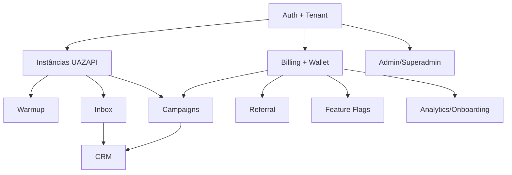

# Análise Consolidada do Projeto — Ruptur SaaS

## 1. Resumo executivo

O Ruptur SaaS já possui uma base operacional relevante para **autenticação**, **multi-tenant**, **wallet**, **billing**, **instâncias WhatsApp via UAZAPI**, **warmup**, **admin/superadmin**, **analytics/onboarding** e parte de **campanhas**. A arquitetura mais recente aponta para uma direção correta de desacoplamento entre integrações externas e motores internos, especialmente com `integrations-core` e `webhook-core`, mas o código ainda convive com blocos legados e implementações paralelas.

O estado real do produto hoje é de **SaaS em transição entre MVP funcional e plataforma estruturada**: há vários fluxos utilizáveis de ponta a ponta, porém com módulos ainda incompletos, acoplamentos legados, lacunas de UX, cobertura de testes desigual e divergências entre documentação, frontend e backend.

Os maiores riscos para assumir a entrega ponta a ponta são:

- coexistência de **duas arquiteturas** em alguns domínios;
- dependências legadas de **Bubble** ainda presentes em `inbox` e `campaigns`;
- inconsistências de schema/tabelas entre serviços, migrations e código;
- presença de documentação aspiracional misturada com documentação operacional;
- parte importante do produto com UI existente, mas sem fechamento total da jornada.

---

## 2. Metodologia e fontes analisadas

Esta análise foi construída por engenharia reversa do repositório, com foco em:

- convenções e governança do projeto;
- gateway principal, rotas e serviços de backend;
- frontend React da área autenticada;
- migrations SQL;
- suíte de testes Jest/Playwright;
- documentação operacional, arquitetural e de produto.

### Fontes principais

- Convenções e qualidade:
  - `AGENTS.md`
  - `CODEX.md`
  - `package.json`
  - `docs/QUALITY_GATE.md`
  - `docs/DEPLOYMENT.md`
- Backend principal:
  - `api/gateway.mjs`
  - `api/routes-billing.mjs`
  - `api/routes-instances.mjs`
  - `api/routes-users.mjs`
  - `api/routes-admin-tenants.mjs`
- Domínios:
  - `modules/billing/**`
  - `modules/integrations-core/**`
  - `modules/webhook-core/**`
  - `modules/providers/**`
  - `modules/provider-adapter/**`
  - `modules/wallet/index.js`
  - `modules/warmup-core/server.mjs`
  - `modules/superadmin/**`
  - `modules/users/**`
  - `modules/inbox/**`
  - `modules/campaigns/**`
- Frontend:
  - `web/client-area/src/App.jsx`
  - `web/client-area/src/services/api.js`
  - `web/client-area/src/contexts/AuthContext.jsx`
  - páginas e componentes principais do client-area
- Banco:
  - `migrations/001_instance_registry.sql`
  - `migrations/002_tenants_and_users.sql`
  - `migrations/004_plans_and_subscriptions.sql`
  - `migrations/005_campaigns.sql`
  - `migrations/007_referral_system.sql`
  - `migrations/012_provider_accounts_and_leases.sql`
  - `migrations/014_integration_and_webhook_core.sql`
  - `migrations/019_analytics_and_onboarding.sql`
- Testes:
  - `jest.config.js`
  - `playwright.config.ts`
  - `tests/**/*.test.js`
  - `tests/e2e-inbox-integration.test.mjs`
  - `tests/e2e/preview.spec.mjs`
- Docs arquiteturais e de negócio:
  - `docs/INTEGRATIONS_AND_WEBHOOK_CORE.md`
  - `docs/UAZAPI_INTEGRATION_COVERAGE.md`
  - `docs/ANALYTICS_AND_ONBOARDING.md`
  - `docs/domains.md`
  - `docs/RUPTUR_SAAS_BIBLIA_COMPLETA.md`

---

## 3. Estado atual do projeto

## 3.1 O que está funcionando em produção ou em condição operacional alta

### 3.1.1 Gateway SaaS, autenticação e SPA

O projeto possui um gateway HTTP central em `api/gateway.mjs`, responsável por:

- servir o frontend autenticado;
- autenticar usuários via JWT Supabase;
- aplicar CORS restritivo;
- expor rotas de billing, tenants, referrals, warmup, admin e analytics.

Evidências:

- bootstrap do gateway e Supabase em `api/gateway.mjs:1-84`
- autenticação via `supabase.auth.getUser(token)` em `api/gateway.mjs:266-279`
- whitelist rígida de origens em `api/gateway.mjs:166-194`
- rota de ambientes disponíveis em `api/gateway.mjs:1108-1117`

Conclusão: **funcional e central para operação atual**.

### 3.1.2 Multi-tenant e seleção de ambiente

O sistema já suporta:

- `user_tenant_memberships`;
- fallback legado por `users.tenant_id`;
- fallback por `tenants.email = user.email`;
- distinção entre ambiente Cliente, Admin e Superadmin.

Evidências:

- schema multi-tenant em `migrations/002_tenants_and_users.sql:1-78`
- composição de acessos em `api/gateway.mjs:322-397`
- montagem de ambientes em `api/gateway.mjs:399-470`
- uso no frontend via `AuthContext` em `web/client-area/src/contexts/AuthContext.jsx:24-95`

Conclusão: **base multi-tenant implementada e estratégica**, mas ainda com compatibilidade legado misturada ao fluxo novo.

### 3.1.3 Billing básico, planos, checkout e subscription

Há backend real para:

- listar planos;
- criar checkout de compra de créditos;
- criar assinatura;
- consultar assinatura ativa;
- processar webhooks de pagamento;
- registrar wallet e histórico financeiro;
- calcular permissões/feature flags por plano.

Evidências:

- scripts oficiais incluem `review`, `quality` e `build` em `package.json:5-38`
- subscribe no gateway em `api/gateway.mjs:760-801`
- documentação/implementação de subscription em `api/routes-billing.mjs:495-629`
- planos e assinatura em `migrations/004_plans_and_subscriptions.sql:1-97`
- pacotes e integração Getnet/Cakto em `modules/billing/getnet.js`
- feature gating por plano em `modules/billing/feature-flags.service.js:1-210`

Conclusão: **billing é um dos módulos mais maduros**, embora ainda haja mistura entre camadas novas e legado.

### 3.1.4 Wallet e ledger de créditos

O projeto já trata wallet como motor de créditos, com histórico transacional.

Evidências:

- `wallet_transactions` é usada por `modules/wallet/index.js` e `modules/billing/billing.service.js`
- frontend de carteira em `web/client-area/src/pages/Wallet.jsx:1-245`
- dashboard usa saldo e envios em `web/client-area/src/pages/DashboardHome.jsx:13-23`
- migrations de wallet e payments existem no repositório (`migrations/002_wallets_and_payments.sql`, `migrations/003_wallet_transactions.sql`)

Conclusão: **funcional em nível operacional**, com papel central no produto.

### 3.1.5 Instâncias WhatsApp e gestão UAZAPI

O fluxo de instâncias está bem adiantado:

- criação de instância;
- alocação de conta provider;
- sync de instâncias remotas;
- conexão/status;
- persistência em `instance_registry`;
- gestão de contas UAZAPI com criptografia de token.

Evidências:

- rotas de instância em `api/routes-instances.mjs:1-240`
- criação de instância com `tenant_provider`, `provider_accounts` e `instance_registry` em `api/routes-instances.mjs:53-183`
- serviço de conta UAZAPI em `modules/providers/uazapi-account.service.js:1-289`
- cobertura documental de endpoints UAZAPI em `docs/UAZAPI_INTEGRATION_COVERAGE.md:1-93`
- schema de registry em `migrations/001_instance_registry.sql:1-118`
- expansão para provider accounts e leases em `migrations/012_provider_accounts_and_leases.sql`

Conclusão: **um dos núcleos mais concretos do produto**.

### 3.1.6 Warmup Manager

O projeto possui runtime dedicado de warmup e tela do cliente para operação de aquecimento.

Evidências:

- runtime principal em `modules/warmup-core/server.mjs`
- proxy/config no gateway em `api/gateway.mjs:1160-1185`
- frontend robusto em `web/client-area/src/pages/Warmup.jsx:1-220`
- scripts de execução separados em `package.json:6-10`
- AGENTS destaca que o gateway faz proxy para o runtime em `AGENTS.md:61-72`

Conclusão: **funcional em arquitetura e UI**, mas dependente da disponibilidade do runtime externo e de configuração correta de proxy.

### 3.1.7 Admin operacional e Superadmin

Há base concreta para:

- checagem de platform admin;
- listar/aceitar/remover superadmins;
- convites de superadmin;
- dashboard de admin/superadmin no frontend.

Evidências:

- rotas de platform admin em `api/gateway.mjs:1187-1340`
- `PlatformAdminService` em `modules/superadmin/platform-admin.service.js:1-278`
- rotas protegidas no frontend em `web/client-area/src/App.jsx:47-55`
- verificação frontend de superadmin em `web/client-area/src/contexts/AuthContext.jsx:97-115`

Conclusão: **funcional, porém mais voltado para governança da plataforma do que para operação avançada completa**.

### 3.1.8 Analytics e Onboarding

Existe implementação de backend, migration e parte de frontend/documentação.

Evidências:

- `AnalyticsService` e `OnboardingService` instanciados no gateway em `api/gateway.mjs:134-137`
- rotas `GET /api/analytics/dashboard` e `GET /api/onboarding/progress` em `api/gateway.mjs:1918` e `api/gateway.mjs:1977`
- guia detalhado em `docs/ANALYTICS_AND_ONBOARDING.md`
- migration dedicada em `migrations/019_analytics_and_onboarding.sql`

Conclusão: **funcional em backend e modelagem, parcialmente fechado na jornada do cliente**.

---

## 3.2 O que está parcialmente implementado

### 3.2.1 Campaigns

Há UI de campanhas e um módulo backend legado, mas o domínio não está estabilizado.

Evidências:

- página de campanhas rica em UI em `web/client-area/src/pages/Campaigns.jsx:1-240`
- schema de campanhas no banco em `migrations/005_campaigns.sql:1-89`
- módulo legado `modules/campaigns/index.js` depende de:
  - `integrations/uazapi/client.js`
  - `integrations/bubble/client.js`
  - cache em memória
- esse módulo não está alinhado com a arquitetura nova de `integrations-core`/`webhook-core`

Conclusão: **parcial e heterogêneo**. Há valor visível, mas a implementação ainda carrega legado e não parece ser a fundação definitiva.

### 3.2.2 Inbox

Há UI, integração Bubble e tentativa de persistência em Supabase/realtime, mas coexistem duas abordagens.

Evidências:

- `modules/inbox/index.js` usa Bubble + UAZAPI legado e memória local
- `modules/inbox/api.js` parece estilo Express, destoando do gateway atual
- frontend `web/client-area/src/pages/Inbox.jsx` já lê `uazapi_chats` via Supabase realtime
- `api/routes-bubble.mjs` mapeia `chats` para `uazapi_chats`

Conclusão: **parcialmente implementado**, com sinal claro de migração de Bubble para Supabase, mas ainda sem núcleo único consolidado.

### 3.2.3 CRM / contatos

Há indícios de CRM, mas não existe um módulo interno consolidado no mesmo nível de billing/warmup.

Evidências:

- docs e visão de produto citam CRM explicitamente em `README.md` e `docs/RUPTUR_SAAS_BIBLIA_COMPLETA.md`
- `docs/UAZAPI_INTEGRATION_COVERAGE.md` cobre contatos, chats, labels e business
- frontend de Inbox consome `uazapi_chats`, mas não há módulo `modules/crm/**`
- ausência de páginas específicas robustas para pipeline CRM no `web/client-area/src/pages/`

Conclusão: **parcial / embrionário**, muito mais como capacidade potencial da integração do que produto CRM fechado.

### 3.2.4 Team management / convites / RBAC de tenant

Há endpoints e componentes, mas também há inconsistência de modelos de tabela.

Evidências:

- rotas de usuários em `api/routes-users.mjs`
- componentes em `web/client-area/src/components/team/**`
- `UserManagementService` usa tabela `user_tenant_roles` em `modules/users/user-management.service.js`
- migrations baseadas em `user_tenant_memberships` e `users`, não em `user_tenant_roles`

Conclusão: **parcial e com risco de drift de schema**.

### 3.2.5 Referral

O referral tem schema, lógica financeira e endpoints, mas pouca evidência de UI de usuário final madura.

Evidências:

- migration dedicada em `migrations/007_referral_system.sql`
- endpoints de referral em `api/gateway.mjs:804-1098`
- lógica de comissão em `modules/billing/getnet.js:758-827`
- documentação de referral no repositório (`REFERRAL_SYSTEM.md`, `REFERRAL_IMPLEMENTATION_SUMMARY.md`)
- ausência de página de referral explícita em `web/client-area/src/pages/`

Conclusão: **backend parcialmente pronto; jornada de produto incompleta**.

---

## 3.3 O que está planejado mas não iniciado ou não concluído de forma operacional

### 3.3.1 Arquitetura agnóstica plena de integrações

O projeto já criou a fundação correta, mas a migração total ainda não aconteceu.

Evidências:

- visão arquitetural em `docs/INTEGRATIONS_AND_WEBHOOK_CORE.md:1-31`
- presets e contracts em `modules/integrations-core/provider-presets.js` e `modules/integrations-core/contracts.js`
- migration 014 cria `integration_accounts`, `integration_webhook_events`, `internal_events` e `integration_idempotency_keys` em `migrations/014_integration_and_webhook_core.sql:1-186`
- módulos legados ainda seguem ativos, como `modules/campaigns/index.js` e `modules/inbox/index.js`

Conclusão: **planejado e parcialmente fundado, mas ainda não internalizado em todo o produto**.

### 3.3.2 CRM full / omnichannel completo

Há visão estratégica clara, mas não há comprovação de implementação fechada.

Evidências:

- `docs/RUPTUR_SAAS_BIBLIA_COMPLETA.md` posiciona Chatwoot, TwentyCRM, omni-channel, IA e SDR como parte da visão
- não há módulo operacional interno correspondente com a mesma maturidade de billing/warmup

Conclusão: **planejado, com insumos, mas não iniciado como domínio interno coeso**.

### 3.3.3 IA, automações avançadas, omnichannel além de WhatsApp

São citados amplamente em documentação estratégica, mas não aparecem como módulos maduros.

Evidências:

- `docs/RUPTUR_SAAS_BIBLIA_COMPLETA.md`
- ausência de módulos internos de IA/omnichannel equivalentes no backend principal

Conclusão: **visão de roadmap, não realidade operacional atual**.

---

## 3.4 Dívidas técnicas e problemas conhecidos

### 3.4.1 Conflito e sujeira documental

O `README.md` contém marcadores de conflito de merge.

Evidência:

- `README.md` possui `<<<<<<< HEAD`, `=======`, `>>>>>>> codex/getnet-prod-fix`

Impacto:

- reduz confiança na documentação;
- indica risco de inconsistência entre branches;
- sinaliza fragilidade no processo de revisão/merge.

### 3.4.2 Convivência de código novo e legado

Os domínios de inbox e campaigns ainda dependem de Bubble e clients legados, em vez de usar integralmente a arquitetura nova.

Evidências:

- `modules/inbox/index.js`
- `modules/campaigns/index.js`
- direção arquitetural oposta em `docs/INTEGRATIONS_AND_WEBHOOK_CORE.md`

Impacto:

- manutenção mais cara;
- comportamento menos previsível;
- maior dificuldade para testes e observabilidade.

### 3.4.3 Inconsistência de tabelas/modelos

Há serviços usando `user_tenant_roles`, enquanto a base principal modela `user_tenant_memberships`.

Evidências:

- `modules/users/user-management.service.js`
- `api/routes-admin-tenants.mjs` consulta `user_tenant_roles`
- `migrations/002_tenants_and_users.sql` cria `user_tenant_memberships`

Impacto:

- risco alto de bugs por schema divergente;
- necessidade de inventário real do banco aplicado em produção.

### 3.4.4 Testes e configs com divergências de diretório

O Playwright aponta para `./test/e2e`, enquanto existem testes também em `tests/e2e`.

Evidências:

- `playwright.config.ts:20` usa `testDir: './test/e2e'`
- existem arquivos em `tests/e2e/preview.spec.mjs`

Impacto:

- parte da suíte pode não estar sendo executada;
- falsa sensação de cobertura.

### 3.4.5 Inconsistência entre documentação e realidade operacional

A documentação combina runbooks operacionais com material aspiracional/estratégico.

Evidências:

- `docs/DEPLOYMENT.md` e `docs/QUALITY_GATE.md` são operacionais
- `docs/RUPTUR_SAAS_BIBLIA_COMPLETA.md` é visão expandida de produto/stack
- `README.md` promete mais do que o código comprova em alguns domínios

Impacto:

- onboarding técnico fica mais difícil;
- exige separar “fato operacional” de “visão”.

### 3.4.6 Cobertura desigual e limiares possivelmente irreais

O Jest define thresholds globais altos, mas a política em `docs/QUALITY_GATE.md` diz que o limite global inicial é `0%`.

Evidências:

- thresholds em `jest.config.js:14-28`
- política em `docs/QUALITY_GATE.md:17-29`

Impacto:

- pode haver inconsistência entre o que deveria bloquear e o que realmente bloqueia;
- processo de qualidade pode não refletir a realidade do legado.

### 3.4.7 Uso de memória local para componentes críticos

Partes do sistema usam `Map`, polling e fila em memória para domínios que deveriam ser persistentes/distribuíveis.

Evidências:

- rate limit em memória no gateway em `api/gateway.mjs:139-165`
- `MemoryIdempotencyStore` em `modules/webhook-core/idempotency.service.js:12-24`
- inbox e campaigns legados em memória

Impacto:

- não escala horizontalmente;
- comportamento inconsistente em restart;
- aceitável para PoC, inadequado como estado final.

---

## 3.5 Status real por módulo

| Módulo | Status real | Resumo |
|---|---|---|
| Auth / Sessão | Funcional | JWT Supabase, guards, ambientes e bootstrap de sessão já operacionais |
| Multi-tenant | Funcional com legado | memberships + fallbacks legados; precisa consolidar |
| Gateway HTTP | Funcional | peça central do SaaS |
| Billing | Funcional avançado | planos, checkout, assinatura, webhooks, wallet, feature flags |
| Wallet | Funcional | histórico e saldo já integrados ao frontend |
| Instâncias / UAZAPI | Funcional avançado | create/sync/connect/status com provider accounts |
| Warmup | Funcional parcial-alta | runtime e UI maduros, dependentes de proxy/runtime |
| Inbox | Parcial | UI existe; backend ainda híbrido Bubble/Supabase/legado |
| Campaigns | Parcial | UI rica e schema no banco; motor ainda híbrido e legado |
| CRM | Baixo / parcial | recursos potenciais via UAZAPI, sem domínio interno maduro |
| Referral | Parcial | backend e comissionamento existem; UI/jornada incompleta |
| Team / RBAC tenant | Parcial | componentes e endpoints existem, schema inconsistente |
| Admin | Funcional parcial | gestão operacional presente |
| Superadmin | Funcional | convites, listagem e proteção existem |
| Analytics | Funcional parcial | backend/migration prontos; UX/uso real ainda precisam confirmar |
| Onboarding | Funcional parcial | fluxo existe, com partes simuladas e gaps de realidade |
| Notifications / Web Push | Parcial | serviços e hooks existem, não aparece como jornada central concluída |
| Integrations-core | Fundação pronta | arquitetura correta iniciada |
| Webhook-core | Fundação pronta | ingestão e idempotência já estruturadas |
| CRM/Omnichannel/IA avançada | Planejado | mais visão de roadmap do que produto implementado |

---

## 4. Análise de requisitos (engenharia reversa)

## 4.1 Requisitos funcionais extraídos do código

### 4.1.1 Autenticação e acesso

O sistema deve:

- autenticar usuários via Supabase Auth;
- identificar o tenant do usuário;
- permitir acesso a múltiplos ambientes por perfil;
- bloquear rotas de admin e superadmin sem permissão.

Evidências:

- `api/gateway.mjs:266-318`
- `api/gateway.mjs:399-470`
- `web/client-area/src/components/ProtectedRoute.jsx:8-47`

### 4.1.2 Provisionamento de tenant

O sistema deve:

- criar ou provisionar tenant ao onboarding/signup;
- vincular usuário ao tenant;
- disponibilizar tenant ao login subsequente.

Evidências:

- `web/client-area/src/contexts/AuthContext.jsx:187-225`
- `api/gateway.mjs:925-981`

### 4.1.3 Billing e monetização

O sistema deve:

- listar planos;
- criar assinatura por tenant;
- permitir compra avulsa de créditos;
- processar webhooks e refletir status financeiro;
- conceder créditos e comissão/referral quando aplicável;
- aplicar limites por plano.

Evidências:

- `api/gateway.mjs:760-801`
- `api/routes-billing.mjs:408-754`
- `modules/billing/getnet.js`
- `modules/billing/feature-flags.service.js`

### 4.1.4 Wallet

O sistema deve:

- manter saldo de créditos por tenant;
- registrar extrato detalhado;
- validar saldo antes de operações consumidoras.

Evidências:

- `modules/billing/billing.service.js:88-215`
- `modules/campaigns/index.js:76-89`
- `web/client-area/src/pages/Wallet.jsx:1-245`

### 4.1.5 Gestão de instâncias WhatsApp

O sistema deve:

- listar instâncias do tenant;
- criar instâncias;
- conectar e consultar status;
- sincronizar instâncias remotas com metadados do tenant.

Evidências:

- `api/routes-instances.mjs:15-240`
- `modules/providers/uazapi-account.service.js:168-289`

### 4.1.6 Warmup

O sistema deve:

- consultar estado e configuração de warmup;
- iniciar, pausar, parar, reiniciar e sincronizar configurações;
- operar rotinas, mensagens e telemetria.

Evidências:

- `web/client-area/src/services/api.js:151-221`
- `web/client-area/src/pages/Warmup.jsx:1-220`
- `api/gateway.mjs:1160-1185`

### 4.1.7 Inbox

O sistema deve:

- exibir conversas e mensagens por tenant/instância;
- suportar recebimento em tempo real;
- marcar leitura;
- enviar mensagens.

Evidências:

- `modules/inbox/api.js`
- `modules/inbox/index.js`
- `web/client-area/src/pages/Inbox.jsx`

Observação: a funcionalidade existe como intenção operacional clara, mas a implementação ainda não está consolidada em um único padrão.

### 4.1.8 Campanhas

O sistema deve:

- criar campanhas;
- carregar contatos por CSV;
- lançar, pausar, parar e excluir campanhas;
- contabilizar métricas de envio;
- consumir créditos.

Evidências:

- `web/client-area/src/pages/Campaigns.jsx:1-240`
- `modules/campaigns/index.js`
- `migrations/005_campaigns.sql`

### 4.1.9 Referral

O sistema deve:

- gerar link/código de referral por tenant;
- permitir claim por novo tenant;
- registrar cliques;
- resumir resultados;
- gerar comissão.

Evidências:

- `api/gateway.mjs:804-1098`
- `modules/billing/getnet.js:758-827`

### 4.1.10 Onboarding e analytics

O sistema deve:

- acompanhar o progresso de onboarding por tenant;
- rastrear eventos de jornada e conversão;
- apresentar métricas de trial → paid.

Evidências:

- `modules/billing/onboarding.service.js`
- `modules/billing/analytics.service.js`
- `migrations/019_analytics_and_onboarding.sql`
- `docs/ANALYTICS_AND_ONBOARDING.md`

---

## 4.2 Requisitos não-funcionais inferidos

### 4.2.1 Segurança

- CORS restritivo por whitelist: `api/gateway.mjs:166-194`
- JWT Supabase no backend: `api/gateway.mjs:266-279`
- validação de schema com `zod` em endpoints críticos: `api/gateway.mjs:760-787`
- segredos criptografados para provider accounts: `modules/providers/uazapi-account.service.js:13-31`
- RLS em múltiplas tabelas das migrations

### 4.2.2 Multi-tenancy e isolamento

- RLS explícito em `tenants`, `users`, `instance_registry`, `campaigns`, `analytics_events`, etc.
- validação de tenant no gateway via `extractAndValidateTenantId`

### 4.2.3 Idempotência e auditabilidade

- idempotência para webhooks em `modules/webhook-core/idempotency.service.js`
- idempotência de billing em `modules/billing/billing.service.js`
- persistência proposta em `integration_webhook_events` e `integration_idempotency_keys`
- auditoria financeira e de instâncias em diversas tabelas/logs

### 4.2.4 Escalabilidade

Há intenção de escala com:

- Redis/Bull para fila de webhook;
- Supabase/Postgres como fonte de verdade;
- separação entre gateway e warmup runtime.

Mas há limitações atuais:

- rate limiting em memória;
- stores em memória para webhook-core/inbox/campaigns legados;
- polling local em inbox.

### 4.2.5 Observabilidade

- logs estruturados no gateway;
- docs de quality gate exigem logs sem segredos;
- não há evidência forte de observabilidade totalmente padronizada por domínio.

### 4.2.6 Performance

Há preocupação com:

- índices nas migrations;
- views agregadas para analytics;
- cache de feature flags por 5 minutos.

Evidências:

- `migrations/019_analytics_and_onboarding.sql`
- `modules/billing/feature-flags.service.js:47-148`

---

## 4.3 Integrações externas e dependências

### UAZAPI

Papel:

- provider principal de WhatsApp;
- gestão de instâncias;
- envio/recebimento de mensagens;
- webhooks;
- contatos/chats/labels.

Evidências:

- `docs/UAZAPI_INTEGRATION_COVERAGE.md`
- `modules/provider-adapter/uazapi-adapter.js`
- `modules/providers/uazapi-account.service.js`
- `api/routes-instances.mjs`

### Stripe

Papel:

- presente como adapter de pagamento no core novo;
- dependência instalada;
- não é a integração principal mais visível no fluxo atual do gateway.

Evidências:

- `modules/integrations-core/adapters/payment/stripe.adapter.js`
- `package.json` contém `stripe`

### Getnet

Papel:

- gateway de billing fortemente implementado;
- checkout, assinatura, webhook e cancelamento.

Evidências:

- `modules/billing/getnet.js`
- `docs/domains.md` define callback canônico Getnet

### Supabase

Papel:

- banco principal;
- autenticação;
- realtime em partes do inbox;
- base de multi-tenant, wallet, billing, onboarding, admin.

Evidências:

- `api/gateway.mjs`
- `web/client-area/src/services/supabase.js`
- migrations em `migrations/**`

### Bubble

Papel:

- legado/importante para inbox e campaigns;
- compatibilidade e integrações anteriores;
- ainda influencia parte do estado real do produto.

Evidências:

- `modules/inbox/index.js`
- `modules/campaigns/index.js`
- `api/routes-bubble.mjs`
- documentação estratégica e E2E de inbox

### SendGrid

Papel:

- dependência instalada para e-mail/convites/notificações;
- no fluxo de superadmin o envio é opcional e pode cair para modo manual.

Evidências:

- `package.json` inclui `@sendgrid/mail`
- `modules/superadmin/platform-admin.service.js:135-169`

---

## 4.4 Gaps entre o que existe e o que um SaaS completo precisa

1. **Inbox e campaigns precisam sair do modo híbrido legado**  
   Sem isso, a operação principal de mensagens seguirá frágil.

2. **CRM ainda não é um domínio de produto maduro**  
   Hoje existe mais como potencial técnico do que solução fechada.

3. **RBAC de tenant precisa consolidar schema**  
   `user_tenant_roles` vs `user_tenant_memberships` é gap estrutural.

4. **Referral precisa de experiência de produto**  
   O backend existe, mas a jornada não parece fechada no frontend.

5. **Onboarding ainda mistura real e simulado**  
   Ex.: QR simulado no frontend de onboarding.

6. **Arquitetura nova precisa substituir legado, não só coexistir com ele**  
   `integrations-core` e `webhook-core` são promissores, mas ainda não dominam toda a base.

7. **Teste E2E de jornadas críticas ainda não está claramente confiável**  
   Há ativos, mas o encaixe de diretórios/configs indica gaps na execução real.

8. **Documentação precisa ser separada em “operacional”, “produto atual” e “visão futura”**  
   Hoje isso está misturado.

---

## 5. Plano de negócio inferido

## 5.1 Proposta de valor do produto

O Ruptur Cloud se posiciona como um SaaS de:

- automação e operação de WhatsApp;
- gestão de instâncias;
- campanhas/disparos;
- warmup anti-ban;
- wallet/créditos;
- billing recorrente;
- administração multi-tenant;
- potencial de CRM/omnichannel.

Evidências:

- `README.md`
- `AGENTS.md`
- páginas `Dashboard`, `Wallet`, `Instances`, `Warmup`, `Campaigns`, `Inbox`

### Proposta de valor resumida

“Permitir que empresas operem WhatsApp de forma escalável, com instâncias gerenciadas, aquecimento, campanhas e cobrança integrada, em um ambiente multi-tenant administrável.”

---

## 5.2 Modelo de monetização

O modelo atual inferido é híbrido:

### Receita recorrente por plano

Planos observados:

- `trial`
- `starter`
- `pro`
- `enterprise` no feature flags
- `business` em migrations legadas de planos

Evidências:

- `modules/billing/feature-flags.service.js:60-97`
- `migrations/004_plans_and_subscriptions.sql:88-96`
- `web/client-area/src/pages/Onboarding.jsx:14-39`

### Receita por créditos

Há compra avulsa de pacotes de crédito:

- `pack-1k`
- `pack-5k`
- `pack-10k`

Evidências:

- `modules/billing/getnet.js:17-21`
- `web/client-area/src/pages/Wallet.jsx`

### Receita incremental por add-ons/capacidade

Inferências baseadas no código:

- limite de instâncias por plano;
- features habilitadas por tier;
- campanhas ativas máximas;
- analytics/API/workflows por plano.

Evidências:

- `modules/billing/feature-flags.service.js`

### Referral como aquisição

- comissão de 25% implementada no billing para referral.

Evidência:

- `modules/billing/getnet.js:758-827`

---

## 5.3 Segmento de mercado alvo

Segmentos inferidos:

- pequenas e médias empresas que usam WhatsApp comercialmente;
- operações de vendas outbound;
- suporte/atendimento com múltiplas instâncias;
- agências e operadores multi-cliente;
- times que precisam escalar mensagens com proteção contra ban.

Evidências:

- nomenclaturas de telas, planos, warmup e campanhas;
- docs estratégicos de omnichannel/CRM/SDR;
- ênfase em instâncias, créditos e campanhas.

---

## 5.4 Diferenciais competitivos inferidos

1. **Warmup integrado ao SaaS**
2. **Billing + wallet + instâncias em uma mesma plataforma**
3. **Arquitetura multi-tenant com admin/superadmin**
4. **Base para integrações agnósticas**
5. **Possibilidade de CRM/referral/analytics dentro do mesmo ecossistema**

O diferencial mais concreto hoje é:  
**combinar gestão de instâncias UAZAPI, warmup, billing de créditos e dashboard multi-tenant em um único produto**.

---

## 6. Jornada do usuário

## 6.1 Personas

- **Cliente owner**: dono da conta/tenant
- **Cliente admin/member**: operação interna do tenant
- **Platform admin**: operação de plataforma
- **Superadmin**: governança total
- **Indicado/referral**: novo cliente potencial

---

## 6.2 Jornada de onboarding

### Fluxo atual

1. usuário acessa landing/login/signup;
2. faz signup com email/senha;
3. backend provisiona tenant;
4. frontend entra em wizard de onboarding;
5. escolhe objetivo;
6. escolhe plano;
7. conecta WhatsApp;
8. vai para dashboard.

Evidências:

- rotas em `web/client-area/src/App.jsx:33-45`
- `AuthContext.signUp` em `web/client-area/src/contexts/AuthContext.jsx:187-225`
- provisionamento em `api/gateway.mjs:925-981`
- wizard em `web/client-area/src/pages/Onboarding.jsx`

### Fricções/gaps

- etapa de provisionamento tem componente visual parcialmente simulado;
- QR code é simulado no frontend do onboarding;
- jornada de plano do onboarding e plano do backend precisam validação fina de alinhamento.

---

## 6.3 Jornada de configuração de instância WhatsApp

### Fluxo esperado

1. cliente entra em `Instâncias`;
2. cria instância;
3. sistema escolhe provider account compatível;
4. cria instância na UAZAPI;
5. salva em `instance_registry`;
6. usuário conecta via QR/pairing;
7. consulta status.

Evidências:

- `api/routes-instances.mjs`
- `modules/providers/uazapi-account.service.js`
- `web/client-area/src/pages/Instances.jsx`

### Fricções/gaps

- depende de provider account ativa e com capacidade;
- parte da UX final de erros/suporte ainda precisa auditoria fina;
- fluxo de limits por plano e por conta provider precisa ser validado ponta a ponta.

---

## 6.4 Jornada de envio de campanhas

### Fluxo esperado

1. cliente cria campanha;
2. importa CSV ou seleciona lista;
3. define mensagem/variações;
4. lança campanha;
5. sistema verifica créditos;
6. fila de envio processa mensagens;
7. métricas retornam ao dashboard.

Evidências:

- `web/client-area/src/pages/Campaigns.jsx`
- `modules/campaigns/index.js`
- `migrations/005_campaigns.sql`

### Fricções/gaps

- motor ainda híbrido e legado;
- dependência de Bubble;
- não ficou claro no código lido o pipeline definitivo de execução distribuída;
- risco de métricas divergirem do banco final.

---

## 6.5 Jornada de uso do inbox

### Fluxo esperado

1. cliente acessa `Inbox`;
2. sistema carrega chats por tenant;
3. realtime atualiza conversas;
4. usuário abre conversa e envia/responde.

Evidências:

- `web/client-area/src/pages/Inbox.jsx`
- `modules/inbox/index.js`
- `modules/inbox/api.js`

### Fricções/gaps

- coexistência Bubble + Supabase + memória;
- não há evidência forte de um backend final unificado para mensagens;
- possibilidade de divergência entre fonte de verdade e UI.

---

## 6.6 Jornada de gestão de contatos / CRM

### Fluxo atual inferido

- parcialmente embutido em inbox/UAZAPI chats/contacts;
- sem módulo de CRM independente maduro.

### Fricções/gaps

- ausência de pipeline, oportunidades, estágios e visão CRM consolidada;
- ainda é muito mais “dados de conversa” do que “produto CRM”.

---

## 6.7 Jornada de billing e pagamento

### Fluxo esperado

1. usuário vê planos/pacotes;
2. cria checkout ou assinatura;
3. redireciona para pagamento;
4. webhook confirma;
5. saldo/plano é atualizado;
6. wallet e dashboard refletem o novo estado.

Evidências:

- `api/gateway.mjs:760-801`
- `api/routes-billing.mjs`
- `modules/billing/getnet.js`
- `web/client-area/src/pages/Wallet.jsx`

### Fricções/gaps

- coexistência de nomenclaturas de plano (`business` vs `enterprise`);
- necessidade de auditoria de consistência entre billing, feature flags e UI.

---

## 6.8 Jornada de warmup

### Fluxo esperado

1. cliente acessa tela de aquecimento;
2. consulta estado atual;
3. ajusta parâmetros e mensagens;
4. inicia/pausa/para/reinicia;
5. acompanha telemetria e rotinas.

Evidências:

- `web/client-area/src/pages/Warmup.jsx`
- `web/client-area/src/services/api.js:151-221`
- `api/gateway.mjs:1160-1185`

### Fricções/gaps

- disponibilidade do runtime é dependência crítica;
- gateway devolve fallback/config, mas o runtime é ponto de falha operacional separado.

---

## 6.9 Jornada de referral

### Fluxo esperado

1. tenant gera link;
2. compartilha código;
3. indicado clica/entra;
4. novo tenant faz claim;
5. pagamento gera comissão.

Evidências:

- `api/gateway.mjs:804-1098`
- `modules/billing/getnet.js:758-827`

### Fricções/gaps

- não há UI clara para o cliente gerenciar/reforçar esse funil;
- tracking existe, mas a experiência comercial parece incompleta.

---

## 7. Épicos e histórias de usuário

## 7.1 Épico: Autenticação, tenant e ambientes

### P0 — História 1
**Como** cliente recém-cadastrado, **quero** ter meu tenant provisionado automaticamente, **para** começar a usar a plataforma sem intervenção manual.

**Critérios de aceite**

- signup cria usuário válido;
- tenant é provisionado;
- membership é criado;
- usuário consegue acessar `/dashboard`;
- falhas de provisionamento ficam auditáveis.

### P0 — História 2
**Como** usuário com múltiplos acessos, **quero** ver meus ambientes Cliente/Admin/Superadmin, **para** navegar para a área correta.

**Critérios de aceite**

- `GET /api/me/environments` retorna ambientes coerentes;
- frontend respeita permissões;
- acesso indevido retorna 403.

---

## 7.2 Épico: Billing, wallet e monetização

### P0 — História 3
**Como** owner do tenant, **quero** assinar um plano pago, **para** desbloquear mais capacidade e recursos.

**Critérios de aceite**

- planos listados corretamente;
- checkout/assinatura criados;
- webhook atualiza subscription;
- plano refletido em feature flags.

### P0 — História 4
**Como** cliente, **quero** comprar créditos avulsos, **para** continuar operando campanhas e envios.

**Critérios de aceite**

- compra cria payment idempotente;
- webhook credita wallet;
- extrato registra operação;
- UI mostra saldo atualizado.

### P1 — História 5
**Como** admin financeiro da plataforma, **quero** auditar pagamentos, webhooks e estornos, **para** investigar falhas e suporte.

**Critérios de aceite**

- histórico disponível por tenant;
- duplicidades são detectadas;
- dados sensíveis são mascarados.

---

## 7.3 Épico: Instâncias WhatsApp / UAZAPI

### P0 — História 6
**Como** cliente, **quero** criar e conectar uma instância WhatsApp, **para** habilitar envios e atendimento.

**Critérios de aceite**

- instância é criada no provider;
- registro local é persistido;
- status é consultável;
- erros de capacidade/configuração são claros.

### P1 — História 7
**Como** admin da plataforma, **quero** sincronizar contas provider e instâncias remotas, **para** manter o inventário consistente.

**Critérios de aceite**

- sync atualiza `instance_registry`;
- provider account reflete `used_instances`;
- eventos são auditados.

---

## 7.4 Épico: Warmup

### P0 — História 8
**Como** cliente, **quero** iniciar e acompanhar o warmup das minhas instâncias, **para** reduzir risco operacional antes de enviar campanhas.

**Critérios de aceite**

- estado do runtime é visível;
- start/pause/stop/restart funcionam;
- configurações persistem/sincronizam;
- falha de runtime gera erro útil.

---

## 7.5 Épico: Campaigns

### P0 — História 9
**Como** cliente, **quero** criar e lançar campanhas, **para** disparar mensagens em massa aos meus contatos.

**Critérios de aceite**

- campanha é salva;
- destinatários são persistidos;
- validação de saldo ocorre;
- lançamento muda status corretamente;
- métricas básicas são atualizadas.

### P1 — História 10
**Como** cliente, **quero** pausar e parar campanhas ativas, **para** manter controle operacional sobre meus envios.

**Critérios de aceite**

- campanha muda para `paused` ou `cancelled/stopped`;
- fila pendente é tratada corretamente;
- UI reflete o novo estado.

---

## 7.6 Épico: Inbox e atendimento

### P0 — História 11
**Como** atendente do tenant, **quero** visualizar conversas em tempo real, **para** responder meus contatos rapidamente.

**Critérios de aceite**

- chats do tenant carregam;
- atualizações aparecem em tempo real;
- isolamento por tenant é garantido.

### P0 — História 12
**Como** atendente, **quero** responder mensagens pelo inbox, **para** operar atendimento sem sair da plataforma.

**Critérios de aceite**

- mensagem é enviada pela instância correta;
- erro de envio é retornado ao usuário;
- histórico da conversa é atualizado.

---

## 7.7 Épico: CRM e contatos

### P1 — História 13
**Como** cliente, **quero** gerenciar contatos e listas, **para** segmentar campanhas e organizar relacionamento.

**Critérios de aceite**

- contatos podem ser listados/importados;
- listas/segmentos são persistidos;
- campanhas consomem esses grupos.

### P2 — História 14
**Como** gestor comercial, **quero** um pipeline CRM ligado às conversas, **para** acompanhar oportunidades e conversões.

**Critérios de aceite**

- negócios/estágios existem;
- conversas e contatos se vinculam a oportunidades;
- relatórios de conversão são possíveis.

---

## 7.8 Épico: Referral

### P1 — História 15
**Como** cliente, **quero** gerar meu link de referral, **para** indicar novos clientes e receber comissão.

**Critérios de aceite**

- link único é gerado;
- resumo mostra cliques, referrals e comissão;
- comissão é registrada após pagamento elegível.

---

## 7.9 Épico: Admin e superadmin

### P0 — História 16
**Como** superadmin, **quero** gerenciar administradores da plataforma, **para** manter a governança operacional.

**Critérios de aceite**

- listar admins;
- convidar novo admin;
- aceitar convite;
- remover admin;
- logs e permissões respeitados.

### P1 — História 17
**Como** admin operacional, **quero** gerenciar tenants, créditos e instâncias, **para** oferecer suporte e operação comercial.

**Critérios de aceite**

- tenants listáveis/editáveis;
- créditos podem ser ajustados;
- instâncias/provider accounts podem ser consultadas.

---

## 8. Cobertura de testes e casos de teste

## 8.1 Cobertura atual observada

### Jest

Há cobertura para:

- billing de checkout;
- integration-core/webhook-core;
- onboarding;
- analytics;
- feature flags;
- user management;
- webhook queue e idempotência;
- comercial admin;
- segurança de billing.

Evidências:

- `tests/billing-credit-checkout.test.js`
- `tests/integration-core.test.js`
- `tests/onboarding-service.test.js`
- `tests/__tests__/analytics-service.test.js`
- `tests/__tests__/feature-flags-cache.test.js`
- `tests/unit/user-management.service.test.js`
- `tests/webhook-queue.test.js`
- `tests/idempotency.test.js`

### Playwright / E2E

Há E2E para:

- preview/home/warmup;
- user management;
- alguns scripts de jornada;
- teste separado de inbox integration fora do Playwright.

Evidências:

- `playwright.config.ts`
- `tests/e2e/preview.spec.mjs`
- `tests/e2e-inbox-integration.test.mjs`

---

## 8.2 Lacunas de cobertura

### Módulos com cobertura relativamente melhor

- billing core
- integrations-core
- webhook-core
- onboarding/analytics

### Módulos com cobertura insuficiente ou pouco clara

- inbox real do client-area
- campaigns ponta a ponta
- fluxos reais de instâncias
- admin/superadmin UI
- referral ponta a ponta
- wallet com integração completa do frontend
- rotas do gateway mais críticas em cenário autenticado

---

## 8.3 Casos de teste necessários por módulo

### Auth / tenant

- login com membership válido
- login sem tenant
- usuário com múltiplos tenants
- usuário superadmin sem tenant cliente

### Billing / wallet

- subscribe trial
- subscribe pago
- webhook duplicado
- pagamento aprovado/negado/cancelado
- crédito wallet idempotente
- refund e extrato

### Instâncias / UAZAPI

- criar instância com account disponível
- bloquear quando capacity excedida
- conectar instância inexistente
- sync account atualiza registry corretamente

### Warmup

- fallback quando runtime indisponível
- start/pause/stop/restart
- sync config válido/inválido
- renderização da tela com estado vazio

### Inbox

- listar chats por tenant
- realtime insert/update
- enviar mensagem
- bloqueio cross-tenant

### Campaigns

- criar campanha draft
- lançar campanha sem saldo
- lançar campanha com CSV
- pausar/parar/deletar
- atualização de métricas

### Referral

- gerar link
- claim válido
- claim duplicado
- clique rastreado
- comissão após pagamento elegível

### Admin / superadmin

- check platform admin
- convite/aceite
- remoção
- acesso negado para não-admin

---

## 8.4 Testes E2E recomendados para jornadas críticas

### P0

1. **Signup → provision tenant → login → dashboard**
2. **Escolher plano → checkout/mock pagamento → wallet/plano atualizado**
3. **Criar instância → conectar → status online**
4. **Warmup start/pause com runtime ativo**
5. **Criar campanha → lançar → consumir créditos**
6. **Receber mensagem → visualizar inbox → responder**

### P1

7. **Convite de superadmin**
8. **Geração e claim de referral**
9. **Onboarding progress + analytics event trail**

---

## 8.5 Estratégia de teste recomendada

### Camada 1 — Unitária

Priorizar:

- billing;
- webhook-core;
- permission/tenant validation;
- provider accounts;
- feature flags.

### Camada 2 — Integração

Cobrir:

- gateway + Supabase mock/stub;
- instâncias e UAZAPI adapter;
- analytics/onboarding;
- referral + wallet.

### Camada 3 — E2E

Focar em:

- jornadas críticas de receita;
- jornadas críticas de ativação;
- jornadas críticas de operação.

### Recomendação estrutural

- unificar diretório/config de E2E;
- separar testes “aspiracionais” de testes efetivamente executados em CI;
- criar matriz mínima obrigatória por módulo P0.

---

## 9. Definição de pronto (DoD)

## 9.1 DoD global

Uma entrega só deve ser considerada **DONE** quando:

1. resolve a jornada funcional completa do escopo;
2. respeita isolamento multi-tenant;
3. não expõe segredos nem dados sensíveis;
4. possui tratamento explícito de erro, vazio e estados intermediários;
5. possui logs mínimos para investigação;
6. possui testes automatizados adequados ao risco;
7. passa em lint, testes e build;
8. está documentada no nível necessário;
9. não introduz acoplamento indevido a provider externo nos motores agnósticos;
10. não quebra produção nem compatibilidade intencional.

---

## 9.2 DoD específico por tipo

### Billing / wallet

- idempotência garantida;
- webhook duplicado não duplica crédito;
- ledger auditável;
- dados sensíveis mascarados;
- plano/feature flags sincronizados.

### Webhooks / integrações

- payload bruto persistido;
- resposta rápida ao provider;
- replay/duplicidade tratados;
- erro vai para fila/reprocessamento quando aplicável.

### Migrations

- idempotentes;
- com RLS consciente;
- índices mínimos incluídos;
- sem políticas quebradas referenciando objetos ausentes.

### Frontend

- loading/erro/empty state;
- guardas de permissão;
- sem chamadas cross-tenant;
- acessos protegidos coerentes.

### Admin / superadmin

- ações auditáveis;
- acesso indevido retorna 403;
- convites e revogações testados.

---

## 10. Roadmap de execução

## 10.1 Princípios de priorização

- primeiro: **ativação, receita e operação segura**
- depois: **fechamento das jornadas core do cliente**
- por fim: **expansões CRM/omnichannel/analytics avançado**

---

## 10.2 Fase 1 — Fundação operacional e saneamento

**Objetivo**

Consolidar a base para operar sem ambiguidades arquiteturais.

**Itens**

- inventário real do schema aplicado em produção;
- resolver divergência `user_tenant_memberships` vs `user_tenant_roles`;
- limpar conflitos/documentação inconsistente;
- unificar padrão de testes E2E;
- validar pipeline real de deploy/quality gate.

**Dependências**

- nenhuma funcional crítica nova; é fundação.

**Complexidade**

- média.

**Critério de encerramento**

- base documental e schema confiáveis;
- times sabem qual é a fonte de verdade por domínio.

---

## 10.3 Fase 2 — Receita e ativação

**Objetivo**

Fechar completamente onboarding, plano, wallet, subscription e instância.

**Itens**

- alinhar planos entre migrations, feature flags e UI;
- revisar onboarding para remover simulações;
- garantir fluxo estável signup → tenant → plano → instância;
- validar webhooks financeiros ponta a ponta.

**Dependências**

- Fase 1 concluída.

**Complexidade**

- alta.

**Critério de encerramento**

- novo cliente consegue entrar, pagar e conectar instância sem intervenção manual.

---

## 10.4 Fase 3 — Operação principal do cliente

**Objetivo**

Fechar inbox, campaigns e uso recorrente da plataforma.

**Itens**

- migrar inbox para backend/fonte de verdade única;
- remover dependência crítica de Bubble nos fluxos core;
- consolidar campanhas no modelo novo;
- ligar wallet ↔ campanhas ↔ métricas.

**Dependências**

- Fase 2.

**Complexidade**

- alta.

**Critério de encerramento**

- cliente consegue operar atendimento e disparo com estabilidade.

---

## 10.5 Fase 4 — Warmup e otimização operacional

**Objetivo**

Tornar o warmup confiável como diferencial competitivo.

**Itens**

- robustez do runtime/proxy;
- observabilidade de warmup;
- regras e telemetria refinadas;
- integração melhor com instâncias do cliente.

**Dependências**

- Fases 2 e 3.

**Complexidade**

- média/alta.

**Critério de encerramento**

- warmup operável como recurso premium e confiável.

---

## 10.6 Fase 5 — Referral, analytics e governança

**Objetivo**

Ampliar aquisição, visibilidade de negócio e operação administrativa.

**Itens**

- UI de referral;
- funil de analytics visível e confiável;
- dashboards admin/superadmin mais completos;
- políticas operacionais e suporte.

**Dependências**

- Fases anteriores estabilizadas.

**Complexidade**

- média.

**Critério de encerramento**

- gestão do funil e operação de plataforma com visibilidade adequada.

---

## 10.7 Fase 6 — CRM e expansões

**Objetivo**

Transformar recursos potenciais em produto de maior ticket.

**Itens**

- CRM interno real;
- pipeline e contatos;
- omnichannel;
- automações e IA.

**Dependências**

- núcleo core já estável.

**Complexidade**

- alta.

**Critério de encerramento**

- Ruptur deixa de ser apenas operação WhatsApp e passa a ser suíte comercial mais ampla.

---

## 11. Dependências entre módulos

### Leitura prática

- sem **tenant e auth**, nada fecha;
- sem **billing/wallet**, monetização e limites não fecham;
- sem **instâncias**, inbox/campaigns/warmup não existem;
- **CRM** depende do fechamento de inbox + campanhas + contatos;
- **referral** depende de billing confiável.

---

## 12. Recomendações executivas para assumir a entrega ponta a ponta

1. **Separar imediatamente o que é “produção real” do que é “visão/roadmap”**  
   Crie uma verdade operacional única.

2. **Tratar inbox e campaigns como prioridade estrutural após billing/instâncias**  
   São os módulos com maior valor, mas ainda mais frágeis.

3. **Consolidar o modelo de RBAC/tenant schema**  
   Isso é risco de manutenção e segurança.

4. **Escolher definitivamente a fundação de mensagens e CRM**  
   Supabase-first parece o caminho mais coerente com a arquitetura atual.

5. **Fechar a jornada de ativação real sem simulações**  
   Signup → pagamento/plano → instância → warmup → primeira ação.

6. **Usar `integrations-core` e `webhook-core` como padrão obrigatório para nova evolução**  
   Não ampliar o legado.

7. **Reestruturar a suíte de testes por risco de negócio**  
   Receita, ativação e operação diária primeiro.

---

## 13. Traceabilidade resumida: etapa → alvos → verificação

| Etapa | Alvos | Verificação |
|---|---|---|
| Governança | `AGENTS.md`, `CODEX.md`, `package.json`, docs de quality/deploy | comandos e políticas oficiais consolidados |
| Estado atual | `api/`, `modules/`, `web/client-area/src/`, `migrations/` | cada módulo classificado com evidência |
| Requisitos | rotas, serviços, schemas, UI | requisitos funcionais e NFRs listados |
| Negócio | billing, wallet, planos, docs | monetização e proposta de valor inferidas |
| Jornadas | onboarding, instâncias, billing, inbox, campaigns, warmup, referral | fluxos descritos e gaps apontados |
| Histórias | todos os domínios principais | backlog com persona, ação, benefício, aceite e prioridade |
| Testes | Jest, Playwright, scripts | cobertura atual e lacunas mapeadas |
| DoD | critérios globais e específicos | padrão de aceite definido |
| Roadmap | dependências entre módulos | ordem de execução e complexidade consolidadas |

---

## 14. Conclusão final

O Ruptur SaaS **não é um projeto verde nem um protótipo cru**. Ele já possui uma espinha dorsal funcional e valiosa, especialmente em:

- gateway;
- auth/multi-tenant;
- billing/wallet;
- instâncias UAZAPI;
- warmup;
- admin/superadmin;
- analytics/onboarding.

Por outro lado, o projeto **ainda não está “produto completo”** porque os módulos que mais definem o uso diário do cliente — especialmente **inbox, campaigns e CRM** — seguem parcialmente implementados ou presos em arquitetura híbrida.

Se você assumir a entrega ponta a ponta, a melhor leitura executiva é:

- **a fundação existe**;
- **a monetização já existe**;
- **o produto pode operar**;
- **mas ainda falta consolidar a camada operacional do cliente e remover ambiguidades estruturais**.

O caminho mais seguro é concluir primeiro o core operacional com base no que já está maduro, e só depois expandir para CRM/omnichannel/IA.
